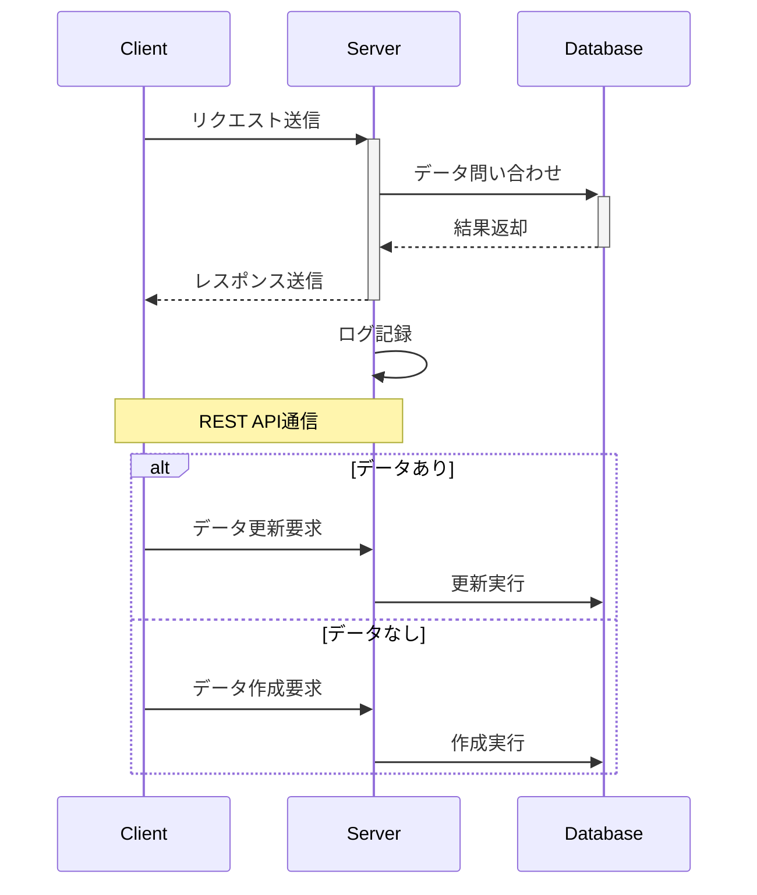

# 環境の作り方

## デフォルト設定関連
- hosts `C:\Windows\System32\drivers\etc\hosts`
- vscode settings `%APPDATA%\Code\User\settings.json`

|概要|設定|
|--|--|
|ファイルフォーマット推測|`"files.autoGuessEncoding": true,`|
|ファイルフォーマット推測対象|`"files.candidateGuessEncodings": ["utf8", "shiftjis"],`|
|カッコで囲まれている範囲を表示|`"editor.guides.bracketPairs": "active",`|
|カラーテーマ|`"workbench.colorTheme": "Default Dark+",`|
|||

## 拡張機能関連
入れたい拡張機能一覧
|機能名|概要|
|--|--|
|Japanese Language Pack for VS Code|日本語化|
|AWS Toolkit|AWS関連の処理いろいろ|
|Draw.io Integration|きれいな図が作れる|
|Excel to Markdown table|Shift+Alt+VでExcelの表をマークダウンのテーブルに変換|
|Markdown All in One|マークダウン関連のあれこれ|
|Markdown Preview Mermaid Support|MarkdownにMermaid埋め込み|
|Mermaid Markdown Syntax Highlight|Mermaidのコードに色付け|
|Hex Editor|たまに欲しくなるバイナリエディタ|
|Prettier - Code formatter|コードフォーマット|

## Markdown関連
|概要|設定|
|--|--|
|サイドパネルにプレビュー表示|`"markdown.extension.preview.autoShowPreviewToSide": true,`|
|段落番号を使用する|`"markdown.extension.toc.orderedList": true,`|
|段落番号の自動付与対象の段落レベル|`"markdown.extension.toc.levels": "2..6",`|
|Githubスタイル適用|`"markdown.styles": ["https://cdnjs.cloudflare.com/ajax/libs/github-markdown-css/5.2.0/github-markdown-light.min.css"]`|
|||

## Drawio関連
|概要|設定|
|--|--|
|テーマ|`"hediet.vscode-drawio.appearance": "light",`|
|カスタムフォント|`"hediet.vscode-drawio.customFonts": ["Yu Gothic","Consolas"],`|
|||

## ショートカットキー
|キー|役割|
|--|--|
|`Shift` + `Alt` + `F`|フォーマット|
|`Shift` + `Alt` + `↑↓`|行の複製|
|`Ctrl` + `Alt` + `↑↓`|マルチカーソル|
|`Ctrl` + `D`|同じワードにマルチカーソル|


## 設定ファイル
```json
{
  "aws.telemetry": false,
  "[typescript]": {
    "editor.defaultFormatter": "vscode.typescript-language-features"
  },
  "github.copilot.nextEditSuggestions.enabled": true,
  "[json]": {
    "editor.defaultFormatter": "esbenp.prettier-vscode"
  },
  "workbench.activityBar.location": "top",
  "workbench.sideBar.location": "right",
  "files.candidateGuessEncodings": ["utf8", "shiftjis"],
  "[jsonc]": {
    "editor.defaultFormatter": "esbenp.prettier-vscode"
  },
  "hediet.vscode-drawio.resizeImages": null,
  "[javascript]": {
    "editor.defaultFormatter": "esbenp.prettier-vscode"
  },
  "markdown.extension.preview.autoShowPreviewToSide": true,
  "markdown.extension.toc.levels": "2..6",
  "markdown.extension.toc.orderedList": true,
  "editor.guides.bracketPairs": "active",
  "workbench.colorTheme": "Default Dark+",
  "files.autoGuessEncoding": true,
  "hediet.vscode-drawio.customFonts": ["Yu Gothic","Consolas"],
  "hediet.vscode-drawio.theme": "kennedy",
  "hediet.vscode-drawio.appearance": "light",
  "markdown.styles": ["https://cdnjs.cloudflare.com/ajax/libs/github-markdown-css/5.2.0/github-markdown-light.min.css"]
}
```

## Mermaid サンプル
