# RDS Custom for SQL Server用のCEVを作成する手順

## はじめに
OSレベルのの操作が必要など、特定の要件を満たすためにSQL Serverのカスタマイズが必要な場合、RDS Custom for SQL Serverを利用してCustom Engine Version（CEV）を作成する必要があります。

この記事では、SQL Server Developer Editionを使ったCEVの作成手順を、つまずきやすいポイントを中心にまとめます。
他のEditionでも基本的な手順は同じですので、参考になれば幸いです。

2025年12月現在、通常のRDSでもSQL Server Developer Edtitionが利用可能になりました。開発用にDeveloper Editionを使いたいだけであれば、RDSの利用を検討してください。

https://aws.amazon.com/jp/about-aws/whats-new/2025/12/amazon-rds-sql-server-supports-developer-edition/


## BYOM（Bring Your Own Media）の要件と制限

### 一般要件
- **サポート対象エディション**: SQL Server 2022/2019 の Enterprise、Standard、Developer エディション
- **SA権限の付与**: `NT AUTHORITY\SYSTEM` に SQL Server システム管理者（SA）サーバーロール権限を付与する
- **タイムゾーン設定**: EC2 Windows Server OS を UTC で設定する（デフォルトで設定済み）
- **ポート設定**: SSM 接続のため TCP ポート 1433 と UDP ポート 1434 を開放する

### 制限事項
- **インスタンス**: デフォルトの SQL Server インスタンス（MSSQLSERVER）のみサポート（名前付きインスタンスは非対応）
- **複数インストール**: 各 AMI では 1 つの SQL Server インストールのみサポート
- **非対応エディション**: Web エディションおよび評価版（Evaluation）は非対応
- **リージョン・バージョン**: 機能の利用可能性は AWS リージョンとデータベースエンジンバージョンに依存

詳しくは、公式ドキュメントの「RDS Custom for SQL Server の BYOM の要件と制限」を参照してください。

https://docs.aws.amazon.com/ja_jp/AmazonRDS/latest/UserGuide/custom-sqlserver.byom.html

## 今回作成するCEVの構成
|設定項目|詳細|
|---|---|
|OS|Windows Server 2019|
|SQL Server|SQL Server 2022 Developer Edition|
|SQL Server Version|16.0.4210.1|

**重要**: OSは必ずWindows Server 2019を使用してください。

SQL Serverのバージョンは、[RDSでサポートされているマイナーバージョン](https://docs.aws.amazon.com/AmazonRDS/latest/UserGuide/SQLServer.Concepts.General.VersionSupport.html)から選択してください。

## ゴールデンイメージの作成
### EC2インスタンスの作成  
RDS Custom for SQL Server用のCEVを作成するためのEC2インスタンスを起動します。SQL Serverのインストールをインターネット経由で行う場合は、インターネットアクセス可能なサブネットに配置し、適切なセキュリティグループを設定してください。
- AMI: Windows Server 2019 Full Base
- インスタンスタイプ: t3.large以上を推奨  
- ストレージ: 最低30GB、40GB以上あると安心

#### 使用オペレーションの確認
EC2インスタンス作成後、AMIの請求情報が正しく設定されていることを確認します。

1. Amazon EC2コンソールで作成したEC2インスタンスを選択
2. **[詳細]** タブを開く
3. **[使用オペレーション]** が `RunInstances:0002` であることを確認

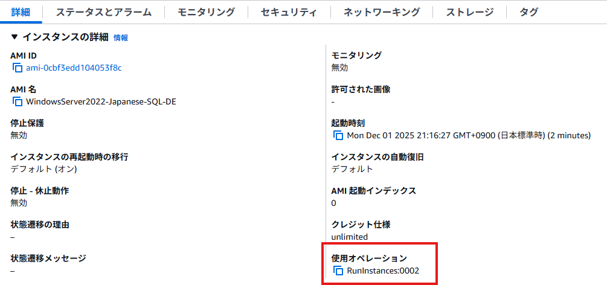


### SQL Server Developer Editionのインストール
EC2インスタンスにSQL Server Developer Editionをインストールします。

私が試した際は、事前に用意したISOイメージをマウントしてインストールしましたが、インターネットから直接インストールすることも可能です。

ISOイメージの作成方法は、Microsoftの公式ドキュメントを参照してください。  
https://learn.microsoft.com/ja-jp/ssms/install/create-offline

#### インストール時の注意点
基本的にはインストールウィザードに従って進めますが、以下の点に注意してください。

1. **インスタンス構成**
- インスタンス名: デフォルトの `MSSQLSERVER` を使用

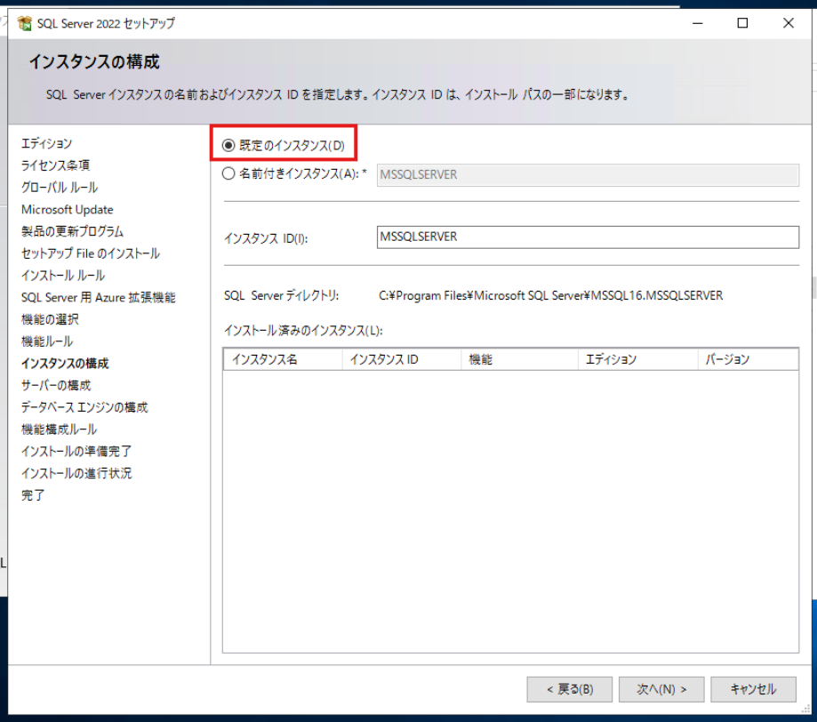

- インスタンスのルートディレクトリ: `C:\Program Files\Microsoft SQL Server\`（変更不可）

1. **サービスアカウント設定**
- SQL Server データベースエンジンアカウント名: `NT Service\MSSQLSERVER` または `NT AUTHORITY\NETWORK SERVICE`
- SQL Server のスタートアップモード: **手動** に設定

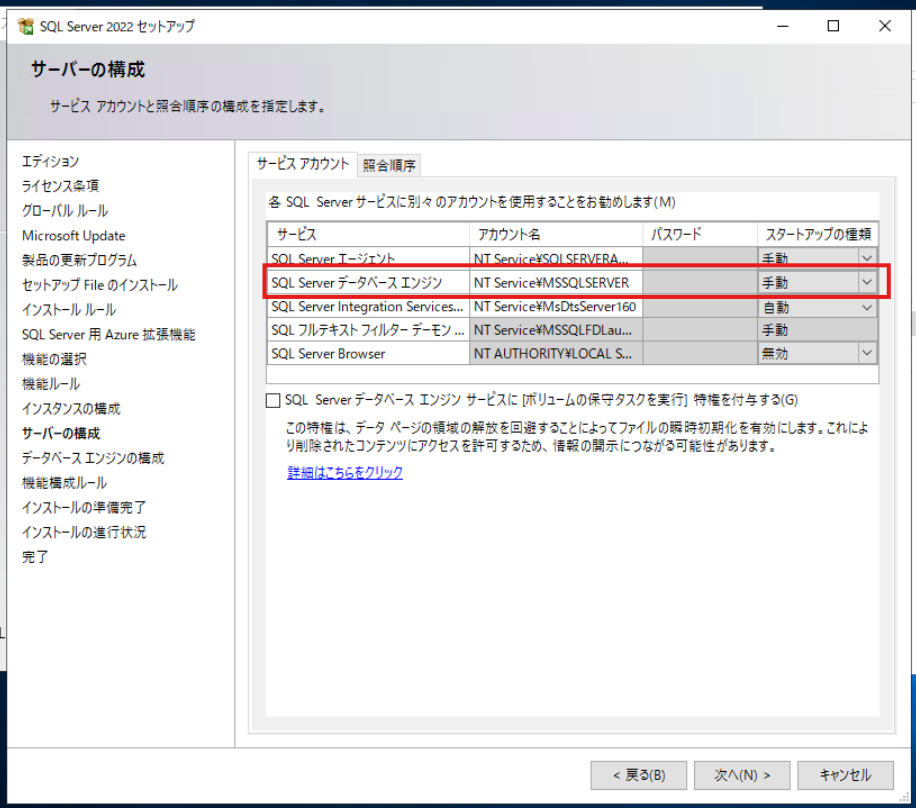

1. **認証モード**
- SQL Server 認証モード: **混合モード（Windows認証とSQL Server認証）** を選択

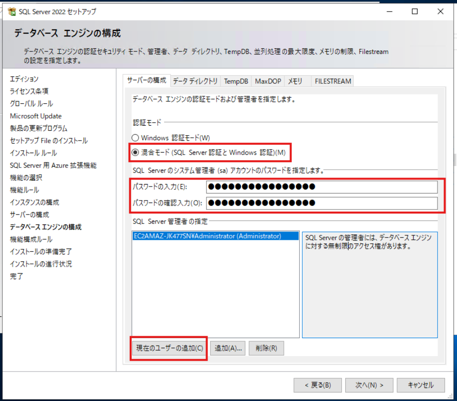

1. **データディレクトリ**
- デフォルトの [データ] ディレクトリ: 現在の設定のまま変更しない
- TempDB ロケーション: 現在の設定のまま変更しない


#### マイナーバージョンの更新
SQL Serverのインストール完了後、指定のマイナーバージョンにアップデートします。

[Microsoft Update カタログ](https://www.catalog.update.microsoft.com/Search.aspx?q=SQL%20Server%202022)から、RDSでサポートされているマイナーバージョンの更新プログラムをダウンロードします。

今回は、2025年12月時点でRDSで使用できる最新バージョン`16.0.4195.2`をダウンロードしてインストールします。

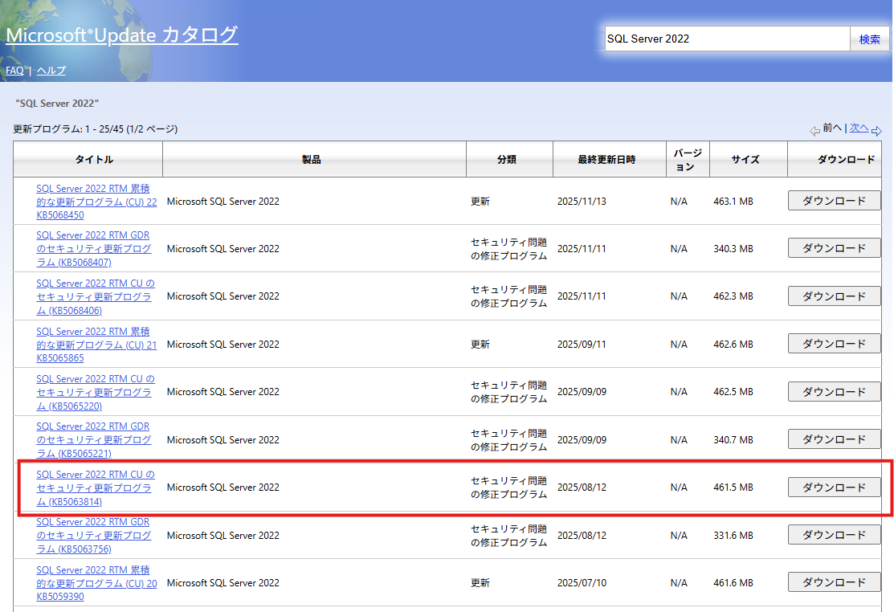

#### SQL Server の権限設定
SQL Serverに対して以下のクエリを実行し、`NT AUTHORITY\SYSTEM` に `sysadmin` 権限を付与します。

```sql
USE [master]
GO
EXEC master..sp_addsrvrolemember @loginame = N'NT AUTHORITY\SYSTEM' , @rolename = N'sysadmin'
GO
```

ついでに、以下のクエリを実行して、バージョンが正しく更新されていることを確認します。

```sql
SELECT @@VERSION
```

#### インスタンス固有のシステム設定を削除してAMIを作成
System Preparation Tool (Sysprep) を使用して、インスタンス固有のシステム設定を削除します。

EC2インスタンスにプリインストールされているEC2Launchを使用してSysprepを実行します。実行完了後、自動的にシャットダウンされます。

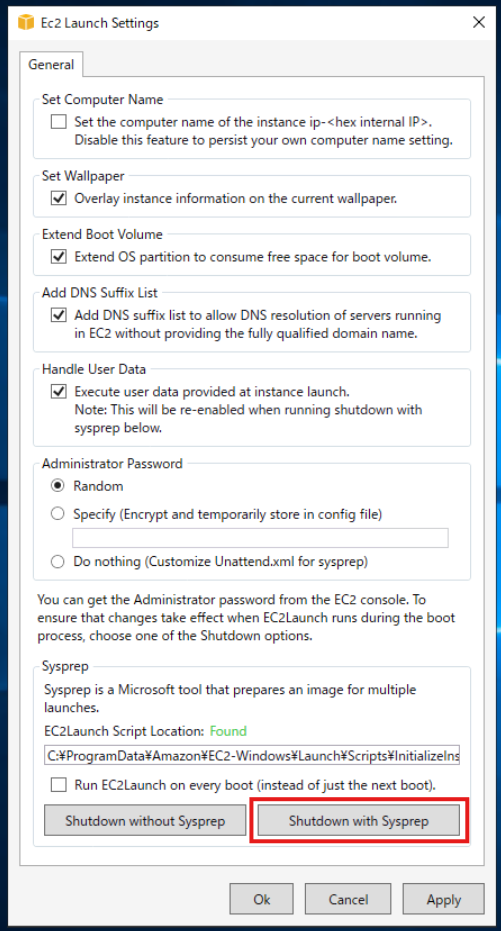

EC2Launchに関する詳しい情報は、以下の公式ドキュメントを参照してください。

https://docs.aws.amazon.com/ja_jp/AWSEC2/latest/UserGuide/ec2launch-sysprep.html

EC2インスタンスがシャットダウンされたら、AMIを作成します。


AMIの作成には約20分かかりました。
この手順で作成したAMIがゴールデンイメージとなります。

## CEVの作成
作成したAMIを使用して、RDS Custom for SQL Server用のCEVを作成します。

RDSコンソールの「カスタムエンジンバージョン」から新しいCEVを作成し、データベースの種類とバージョンを選択した後、前の手順で作成したAMIを指定します。

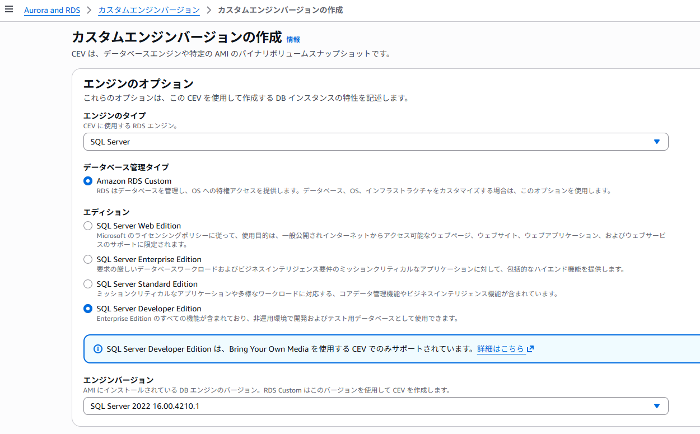

## RDS Custom for SQL Server インスタンスの作成

### 前提条件の準備
RDS Custom for SQL Serverインスタンスを作成する前に、リソースを準備する必要があります。

**必要なリソースの一例**
- **KMSキー**: カスタマーマネージド対称暗号化キー（AWSマネージドキーはおそらく不可）
- **IAMインスタンスプロファイル**: 特定のポリシーをアタッチしたIAMロールを作成し、インスタンスプロファイルとして設定
- **VPC構成**: RDSインスタンス用のVPC、サブネットグループ、セキュリティグループ、エンドポイントなど
- **そのほかいろいろ**

これらを手動で作成するのは手間がかかるため、今回はAWSが提供するCloudFormationテンプレートを使用します。

**CloudFormationテンプレートの使用:**
1. [公式ドキュメント](https://docs.aws.amazon.com/ja_jp/AmazonRDS/latest/UserGuide/custom-setup-sqlserver.html)からテンプレートをダウンロード
2. CloudFormationコンソールでスタックを作成（約3分で完了）
3. 出力タブで作成されたリソースIDを確認

今回はテスト用途のため、デフォルト設定のままスタックを作成しました。本番環境では、ドキュメントを参考に適切な設定を行う必要があります。

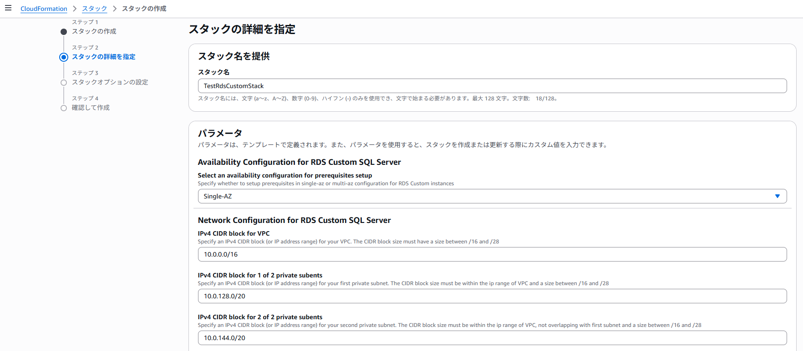

### DBインスタンスの作成
CloudFormationスタックの準備が完了したら、RDSコンソールから新しいデータベースを作成します。

**設定のポイント:**
- エンジンバージョン: 前の手順で作成したCEVを指定

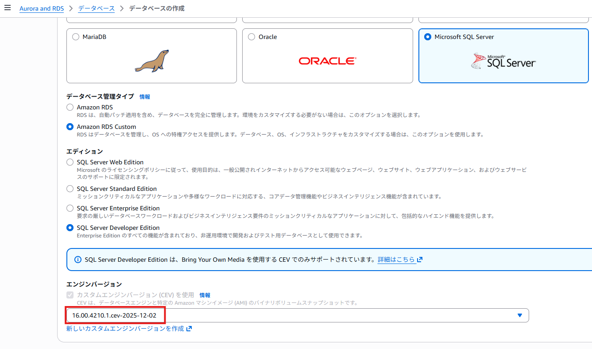

VPC、サブネット、セキュリティグループ、IAMインスタンスプロファイル、AWS KMSキーは、CloudFormationで作成したものを指定します。
（以下の画像は、CloudFormationのスタック名をTestRdsCustomStackにした場合の例です）

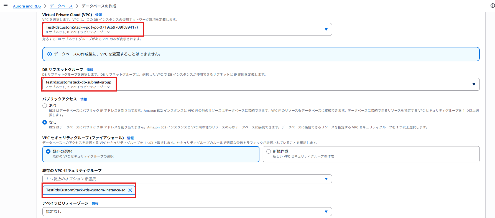
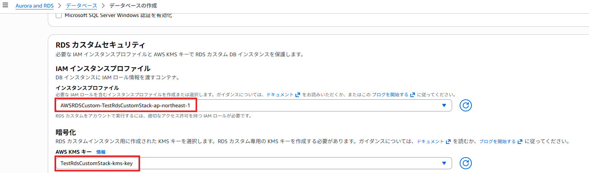

なにも問題ないことを祈りつつ、インスタンスを作成します。

無事にインスタンスが作成できて、指定したマスターユーザー名とパスワードで接続できれば成功です。
（作成まで約１時間程度かかりました。）


カスタムエンジンバージョンも、検証中から利用可能になっているはずです。

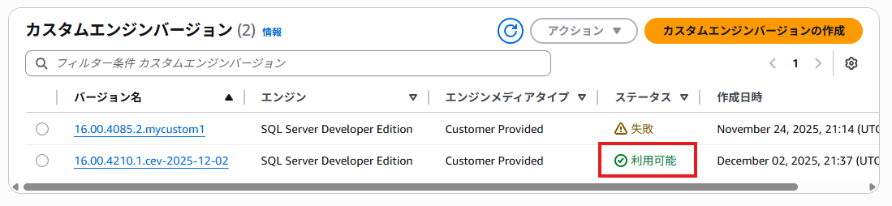

## まとめ

前提条件が想像以上に多く大変でした。ゴールデンイメージの作成や、RDSインスタンスの作成などはEC2 Image Builderや、CloudFormationで自動化しておくとよいと思います。

### 参考情報
- SQL Server 2022 の各エディションとサポートされている機能
https://learn.microsoft.com/ja-jp/sql/sql-server/editions-and-components-of-sql-server-2022?view=sql-server-ver17

- RDS Custom for SQL Server の使用
https://docs.aws.amazon.com/ja_jp/AmazonRDS/latest/UserGuide/working-with-custom-sqlserver.html

```powershell
Read-S3Object -BucketName "share-bucket-20251201-225022" -Key "SetupResource/sqlserver2022-kb5063814-x64_313d8d9a63949f35b79d893abd3b317ed9223e32.exe" -File "sqlserver2022-kb5063814-x64_313d8d9a63949f35b79d893abd3b317ed9223e32.exe"
```